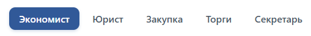
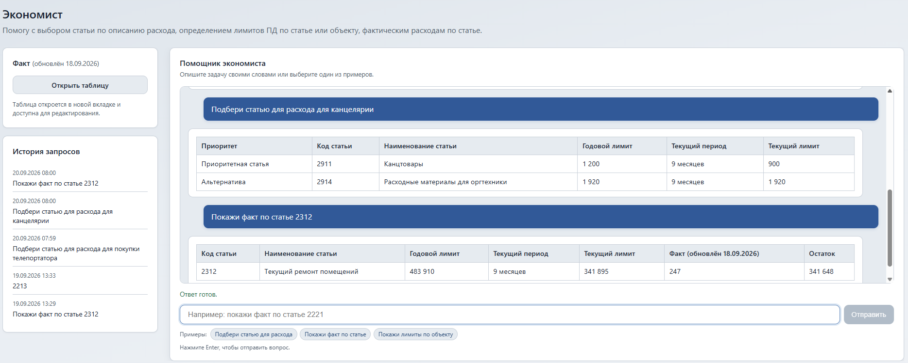
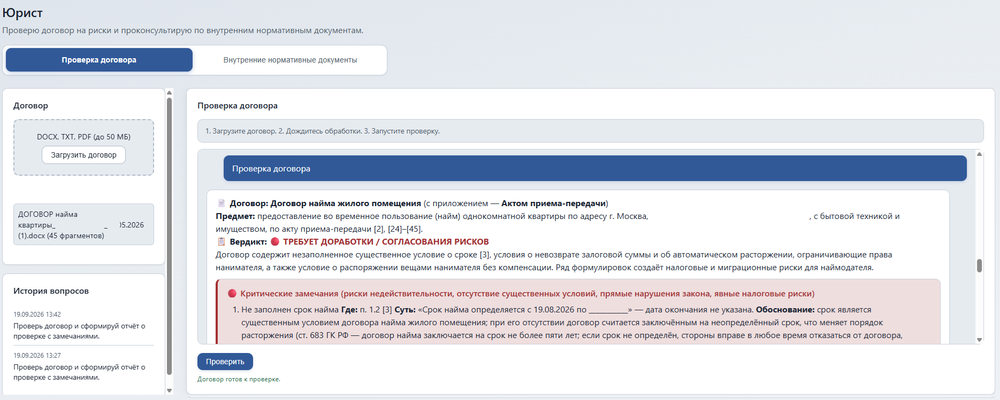
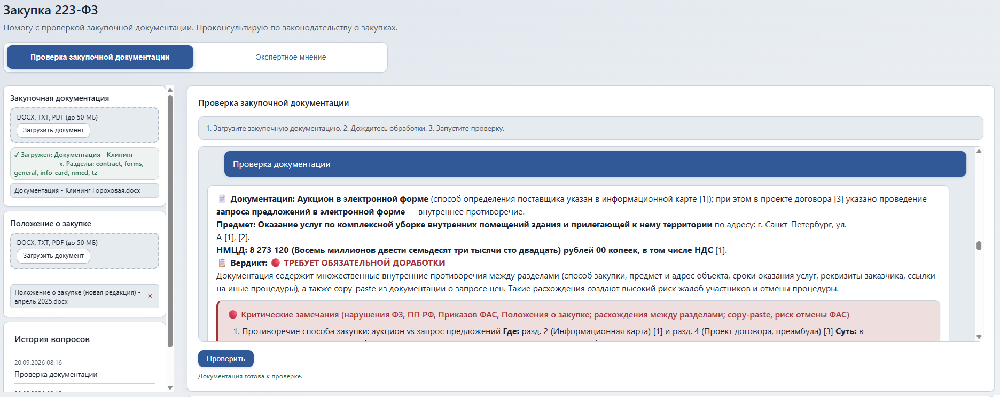
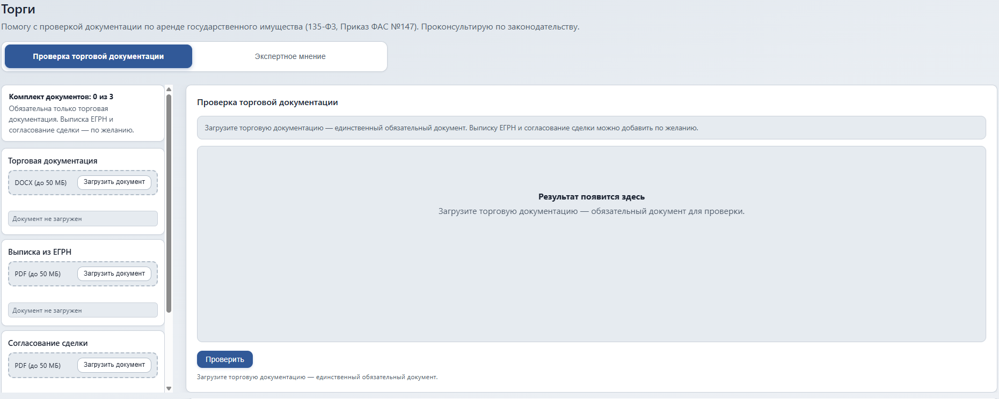
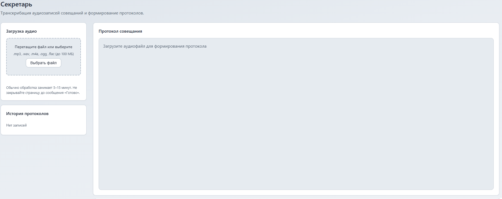

# ИИ-помощник Компании

Веб-приложение для сотрудников: **Экономист**, **Юрист**, **Закупка**, **Торги**, **Секретарь**.  
Один сайт; общие базы документов (Юрист, Положение о закупке); **личная история** запросов у каждого пользователя (cookie в браузере).



**Каталог проекта на сервере:** `~/AI_DID` (все данные, конфигурация и логи — внутри него).

## Стек

| Слой | Технологии |
|------|------------|
| Backend | Python 3.11+, FastAPI, Uvicorn |
| Frontend | HTML, CSS, JavaScript |
| LLM | GigaChat или DeepSeek (ключ в `.env`, выбор модели — в настройках приложения) |
| Поиск по документам | ChromaDB + эмбеддинги GigaChat / OpenAI / локально |
| Речь (Секретарь) | faster-whisper |
| Обезличивание (Секретарь) | Natasha (NER, ru) + pymorphy2 + регулярные выражения |
| Экономист | n8n (webhook) + Google Таблица |

---

## Каталог `AI_DID`

После установки и первого запуска в `~/AI_DID` находятся:

```
~/AI_DID/
├── .env                    # ключи и настройки (не в git)
├── venv/                   # виртуальное окружение Python
├── logs/                   # uvicorn.log при запуске через nohup
├── chroma_data/            # векторные индексы (Юрист, Положение о закупке)
├── secretary/uploaded/     # загруженные аудиофайлы
├── lawyer/uploaded/        # документы базы Юриста
├── procurement/uploaded/   # закупочная документация (сессия)
├── procurement/policy/     # Положение о закупке (общее)
├── procurement/cache/      # кэш разбора закупочной документации
├── tenders/uploaded/       # временные загрузки (сессия)
├── tenders/cache/          # кэш разбора торговых документов
├── models/                 # локальная модель эмбеддингов (если EMBEDDING_PROVIDER=local)
├── economist/              # модуль Экономист
├── secretary/              # модуль Секретарь
├── lawyer/                 # модуль Юрист
├── procurement/            # модуль Закупка 223-ФЗ
├── tenders/                # модуль Торги
├── core/                   # LLM, эмбеддинги, история, сессии, настройки, курс ЦБ
├── static/                 # CSS, JS, img (логотип, фавикон, иконка настроек)
├── templates/              # HTML
├── docs/                   # инструкции (n8n, GitHub)
├── scripts/                # утилиты
├── app_settings.json       # наименование компании и выбранная модель (создаётся при первом сохранении)
├── main.py
├── config.py
└── requirements.txt
```

Путь можно задать иначе, но далее в инструкциях используется **`~/AI_DID`**.

---

## Модули

Порядок в меню: **Экономист → Юрист → Закупка → Торги → Секретарь**.

### Экономист

Помощник по бюджету и фактическим расходам.


- Чат: подбор статьи, лимиты ПД, факт по статье или объекту.
- Ответ текстом или таблицей (если n8n вернул структурированные данные).
- Кнопка «Открыть таблицу» — Google Sheets с фактом.

**Схема:** вопрос на сайте → webhook **n8n** (`N8N_ECONOMIST_WEBHOOK_URL`) → ваша логика (LLM, Sheets, 1С) → ответ в чат.

Настройка: `ECONOMIST_FACT_SHEET_URL`, `N8N_ECONOMIST_WEBHOOK_URL`. Подробнее: [docs/N8N_ECONOMIST.md](docs/N8N_ECONOMIST.md).

---

### Юрист



Два режима (переключатель на странице):

| Режим | Назначение |
|-------|------------|
| **Проверка договора** | Загрузка одного договора (DOCX, TXT, PDF до 50 МБ) → отчёт: **📄 Договор / Предмет / Стороны**, **📋 Вердикт** (🟢/🔴), блоки 🔴 / 🟡 с полями **Где / Суть / Обоснование**. Договор разбивается на пункты-фрагменты `[N]`; в контекст LLM — **пункты договора** до `CHECK_LLM_CONTEXT_CHARS`; в блоке «Источники» — `п. N` / `фрагм. N`. Договор — один на сессию (личный). |
| **Внутренние нормативные документы** | Поиск по внутренним документам (положения, приказы, регламенты) со ссылками `[1]`, `[2]`… и блоком **«Источники»** (документ + страница). |

- Загрузка документов базы — **DOCX**, **TXT** (рекомендуется), **PDF** до 50 МБ; база и индекс Chroma (`lawyer_kb`) — **общие** для всех сотрудников.
- На странице указано: *поиск по PDF не эффективен* — для сканов используйте **DOCX** или PDF с текстовым слоем.

**Как работает RAG**

1. Документ → чанки (~`LAWYER_CHUNK_SIZE` символов) → эмбеддинги в `chroma_data/`.
2. На вопрос — гибридный поиск (ключевые слова + семантика), до **`LAWYER_CONTEXT_K`** фрагментов (по умолчанию 8) в промпт LLM.
3. Эмбеддинг GigaChat обрезается до ~480 символов на фрагмент (`GIGACHAT_MAX_EMBED_CHARS`) — лимит API; **полный текст чанка** хранится в Chroma и передаётся модели.

**PDF:** текстовый слой — через PyMuPDF; сканы — RapidOCR (качество часто низкое). **Файлы и индекс** — общие.

---

### Закупка 223-ФЗ

Проверка закупочной документации и консультации по законодательству о закупках.


Два режима (переключатель на странице):

| Режим | Назначение |
|-------|------------|
| **Проверка закупочной документации** | Загрузка одного файла (DOCX, TXT, PDF до 50 МБ) → отчёт: **📄 Документация**, **📋 Вердикт**, блоки 🔴 / 🟡 с полями **Где / Суть / Обоснование**. В контекст LLM: **полные разделы документации** (до `CHECK_LLM_CONTEXT_CHARS`) + **фрагменты Положения о закупке**; сверка с **223-ФЗ** и **Положением**. |
| **Экспертное мнение** | Свободный вопрос: **223-ФЗ** и загруженное **Положение о закупке** (Chroma `procurement_kb`) — равноправно; без Положения — только закон. |

- **Закупочная документация** — одна на сессию (личная).
- **Положение о закупке** — общая база (как у Юриста), с возможностью удаления файлов из списка.
- После обновления парсера DOCX (таблицы в Положении, в т.ч. **Таблица 1**, п. 2.13) **загрузите Положение заново** — старый индекс мог быть без строк таблиц.

---

### Торги

Проверка комплекта документов по аренде государственного имущества (135-ФЗ, Приказ ФАС №147).


Два режима:

| Режим | Назначение |
|-------|------------|
| **Проверка торговой документации** | Три файла: **торговая документация** (DOCX), **выписка ЕГРН** (PDF), **согласование сделки** (PDF). Автопроверка по правилам + отчёт LLM по **полному тексту** комплекта (до `CHECK_LLM_CONTEXT_CHARS`): **📄 Документация**, **📋 Вердикт**, блоки 🔴 / 🟡 и баннер оценки (0–100). |
| **Экспертное мнение** | Вопрос по 135-ФЗ и Приказу ФАС №147 **без** загрузки документов (`POST /tenders/expert/query`). |

- Перекрёстная проверка: кадастровый номер, адрес, площадь, арендодатель между документами.
- RAG и Chroma **не используются** — rule-based проверка + LLM.

---

### Секретарь

Протоколы совещаний из аудио.


- Форматы: `.mp3`, `.wav`, `.m4a`, `.ogg`, `.flac` (до 100 МБ).
- Распознавание **Whisper** (русский), протокол через LLM.
- Вкладка **«Обезличивание документов»** — текст, DOCX, PDF; находит и маскирует организации, ИНН, ФИО, телефоны, e-mail, адреса и банковские реквизиты. Наименование компании берётся из настроек приложения (кнопка-шестерёнка) и распознаётся сразу после сохранения, перезапуск не нужен.

На сервере нужен **ffmpeg**: `sudo apt install -y ffmpeg`.

---

## История вопросов

- Хранится **в памяти процесса** uvicorn, привязана к cookie `did_sid`.
- **Не передаётся** в LLM при новом вопросе — только для списка в боковой панели и восстановления чата после обновления страницы.
- Сбрасывается при **перезапуске** сервера.

| Модуль | Переменная | По умолчанию |
|--------|------------|--------------|
| Экономист, Юрист, Секретарь | `HISTORY_SIZE` | 5 |
| Закупка | `PROCUREMENT_HISTORY_SIZE` | 3 |
| Торги | `TENDERS_HISTORY_SIZE` | 3 |

---

## Настройки приложения

Кнопка-шестерёнка в подвале любой страницы открывает окно настроек:

- **наименование компании** — подставляется в подвал и заголовок страниц, используется в обезличивании документов (Секретарь);
- **модель LLM** — применяется ко всем модулям, которые работают через LLM приложения (Юрист, Закупка, Торги, Секретарь). Список разбит по семействам: «Модели DeepSeek» и «Модели GigaChat»; показываются только модели, которые реально доступны в API (см. ниже);
- **логотип** — замена картинки в левом верхнем углу; применяется сразу, без перезапуска.

Значения хранятся в `app_settings.json` рядом с приложением и применяются **без перезапуска сервера**. Секретов в файле нет: доступность моделей определяется по ключам в `.env`, сами ключи через API не выдаются. Скопируйте `app_settings.json` на сервер, если хотите задать настройки вручную.

```json
{
  "company_name": "ФГУП \"ДИД\"",
  "model": "deepseek-flash",
  "logo": "logo.png"
}
```

| Запрос | Назначение |
|--------|------------|
| `GET /api/settings` | текущие настройки, каталог моделей, курс ЦБ |
| `POST /api/settings` | сохранить `company_name` и `model` |
| `GET /api/settings/models` | только каталог моделей; `?refresh=true` — не брать из кэша |
| `POST /api/settings/logo` | заменить логотип (multipart, поле `file`) |
| `DELETE /api/settings/logo` | вернуть исходный `static/img/logo.png` |

Модель по умолчанию берётся из `.env` (`LLM_PROVIDER`, `DEEPSEEK_MODEL`, `GIGACHAT_MODEL`); значения, которых нет в каталоге, берутся как есть.

### Логотип

- Файл кладётся в `static/img/logo_custom.<ext>`, исходный `static/img/logo.png` не удаляется; в настройках хранится только имя файла.
- Допустимы PNG, JPEG, GIF, WEBP (проверяется сигнатура файла и целостность через Pillow), размер — до 2 МБ, меняется переменной `LOGO_MAX_BYTES`. SVG и прочие форматы не принимаются.
- «Вернуть исходный» удаляет загруженный файл и возвращает `logo.png`. Ссылка на картинку содержит метку времени, поэтому браузер не показывает старую версию.

### Каталог моделей

Модели в окне настроек — только те, что можно выбрать в кабинете проекта. Это пересечение двух источников: список моделей API (`GET /models` рабочего пространства GigaChat, `GET /models` аккаунта DeepSeek) и список ID, разрешённых для стенда — `GIGACHAT_AVAILABLE_MODELS` и `DEEPSEEK_AVAILABLE_MODELS` в `.env`. Второй список нужен потому, что рабочее пространство отдаёт и закрытые freemium-модели (GigaChat 3 Pro, GigaChat 3 Lightning), которых нет в списке моделей проекта. Пустое значение переменной снимает ограничение.

Проверка кэшируется на 10 минут; если она не удалась (нет сети, не задан ключ), показывается разрешённый каталог с пометкой «список моделей в API проверить не удалось», а выбрать модель, которой нет в API, нельзя.

**Модели DeepSeek**

| ID | Название | Параметры | Контекст | Цена |
|----|----------|-----------|----------|------|
| `deepseek-flash` | DeepSeek-V4.1-Flash | 284B всего / 13B активных (MoE) | 1 000 000 | 50,60 / 101,21 ₽ |
| `deepseek-v4-pro` | DeepSeek-V4-Pro-0813 | 1,6T всего / 49B активных (MoE) | 1 000 000 | 167,00 / 333,99 ₽ |

**Модели GigaChat**

| ID | Название | Параметры | Контекст | Цена |
|----|----------|-----------|----------|------|
| `GigaChat-3-Ultra` | GigaChat 3 Ultra | 702B всего / 36B активных (MoE) | 128 000 | не опубликована |
| `GigaChat-2` | GigaChat 2 Lite | 20B всего / 3B активных (MoE) | 128 000 | 65 ₽ |
| `GigaChat-2-Pro` | GigaChat 2 Pro | не опубликовано | 128 000 | 500 ₽ |
| `GigaChat-2-Max` | GigaChat 2 Max | не опубликовано | 128 000 | 650 ₽ |

- Модели в списке документации Сбера: [GigaChat 3 Ultra, GigaChat 2 Max, GigaChat 2 Pro, GigaChat 2 Lite](https://developers.sber.ru/docs/ru/gigachat/models). GigaChat 3 Pro и GigaChat 3 Lightning рабочее пространство отдаёт в `GET /models`, но в списке моделей проекта их нет, поэтому в настройках они скрыты (их параметры: [GigaChat 3.1 Lightning](https://huggingface.co/ai-sage/GigaChat3.1-10B-A1.8B) — 10B/1,8B; у Pro открытых весов нет).
- Цены GigaChat — за 1 млн выходных токенов, [тарифы Сбера для юрлиц](https://developers.sber.ru/docs/ru/gigachat/tariffs/legal-tariffs?mode=sync). Для GigaChat 3 Ultra тариф для юрлиц Сбер не публикует — цена показана как «не опубликована».
- Цены DeepSeek — [тарифы DeepSeek](https://api-docs.deepseek.com/quick_start/pricing/) за $; в таблице они **пересчитаны в рубли по курсу ЦБ** (доллары — в подписи мелким шрифтом). Курс берётся из официального XML ЦБ, кэш 6 часов, при недоступности сайта показывается последний известный курс.
- **Параметры закрытых API-моделей Сбер не раскрывает** — числа подтверждаются открытыми весами в аккаунте `ai-sage` на HuggingFace (лицензия MIT): [GigaChat-20B-A3B](https://huggingface.co/ai-sage/GigaChat-20B-A3B-base) для Lite, [GigaChat 3.1 Ultra](https://huggingface.co/ai-sage/GigaChat3.1-702B-A36B) (702B/36B) для Ultra, плюс [доклад команды](https://arxiv.org/abs/2506.09440). У GigaChat 2 Pro/Max открытых весов нет — в таблице «не опубликовано», и ссылка «параметры» не показывается. [GigaChat 3.5 Ultra](https://huggingface.co/ai-sage/GigaChat3.5-432B-A28B) (432B/28B) в API этого аккаунта не отдаётся.
- Контекст GigaChat 2 Lite/Pro/Max и 3 Ultra — 128 тыс. токенов по [истории обновления моделей](https://developers.sber.ru/docs/ru/gigachat/models/updates).
- Старые ID поддерживаются как псевдонимы: `GigaChat` → `GigaChat-2`, `GigaChat-Pro` → `GigaChat-2-Pro`, `GigaChat-Max` → `GigaChat-2-Max`. При `GIGACHAT_SCOPE=GIGACHAT_API_PERS` старые ID API не принимает — каталог приводит их к актуальным.
- Все временные интервалы в интерфейсе (пиковые часы DeepSeek, история) — **по московскому времени**, `APP_TIMEZONE=Europe/Moscow`.

---

## Установка

### Сервер (Linux, VPS)

```bash
cd ~
git clone https://github.com/USER/REPO.git AI_DID
cd ~/AI_DID
python3 -m venv venv
source venv/bin/activate
pip install -r requirements.txt
cp .env.example .env
nano .env
sudo apt install -y ffmpeg
mkdir -p logs
```

В `.env` укажите ключи LLM, webhook n8n, при необходимости таблицу факта.

**Эмбеддинги на VPS без GPU** (без PyTorch и `nvidia_*`, экономия >2 ГБ):

```env
EMBEDDING_PROVIDER=gigachat
GIGACHAT_CREDENTIALS=...
GIGACHAT_MAX_EMBED_CHARS=480
```

После смены `EMBEDDING_PROVIDER`, модели эмбеддингов или `LAWYER_CHUNK_*` — **очистите индекс Юриста** и загрузите документы заново.

### Локальная разработка (Windows)

Тот же каталог можно назвать `AI_DID`, например `D:\AI_DID`:

```bat
cd D:\AI_DID
python -m venv venv
venv\Scripts\activate
pip install -r requirements.txt
copy .env.example .env
```

Локальные эмбеддинги (`EMBEDDING_PROVIDER=local`):

```bash
pip install torch --index-url https://download.pytorch.org/whl/cpu
pip install "sentence-transformers>=2.3.0,<3.0.0"
python scripts/download_embedding_model.py
```

Модель сохранится в `~/AI_DID/models/`.

---

## Запуск

Всегда из каталога проекта:

```bash
cd ~/AI_DID
source venv/bin/activate
```

**Проверка (интерактивно):**

```bash
uvicorn main:app --host 0.0.0.0 --port 8000
```

**Продакшен (фон):**

```bash
nohup uvicorn main:app --host 0.0.0.0 --port 8000 > logs/uvicorn.log 2>&1 & tail -f logs/uvicorn.log
```

На продакшене **без** `--reload`. После обновления кода **перезапускайте** uvicorn — иначе новые маршруты и правки API не подхватятся.

Откройте в браузере: `http://IP_СЕРВЕРА:8000` (не `0.0.0.0`). Порт **8000** — в firewall.

**Остановка:**

```bash
lsof -i :8000
kill <PID>
```

---

## Обновление

```bash
cd ~/AI_DID
git pull
source venv/bin/activate
pip install -r requirements.txt
# перезапустите uvicorn
```

---

## Конфигурация (`.env` в `~/AI_DID`)

| Переменная | Назначение |
|------------|------------|
| `LLM_PROVIDER` | `deepseek` или `gigachat` — провайдер по умолчанию |
| `DEEPSEEK_API_KEY` / `GIGACHAT_CREDENTIALS` | Ключи API |
| `DEEPSEEK_MODEL` / `GIGACHAT_MODEL` | Модель по умолчанию, если в настройках ещё ничего не выбрано (`deepseek-chat`, `GigaChat`) |
| `DEEPSEEK_BASE_URL` | Адрес API DeepSeek |
| `GIGACHAT_SCOPE` | `GIGACHAT_API_PERS` — только актуальные ID моделей (`GigaChat-2`, `GigaChat-2-Pro`, `GigaChat-2-Max`, `GigaChat-3-Ultra`) |
| `GIGACHAT_AVAILABLE_MODELS` / `DEEPSEEK_AVAILABLE_MODELS` | ID моделей, доступных для выбора в настройках, через запятую. По умолчанию 4 модели GigaChat и 2 DeepSeek; пустое значение — не ограничивать |
| `COMPANY_NAME` | Наименование компании по умолчанию, пока не задано в настройках |
| `SETTINGS_FILE` | Путь к файлу настроек (по умолчанию `app_settings.json` в корне проекта) |
| `EMBEDDING_PROVIDER` | `gigachat`, `openai` или `local` |
| `GIGACHAT_MAX_EMBED_CHARS` | Лимит текста на эмбеддинг GigaChat (480; API ~514 токенов) |
| `LAWYER_CHUNK_SIZE` / `LAWYER_CHUNK_OVERLAP` | Размер чанков в индексе (1000 / 150 в типовой настройке) |
| `LAWYER_CONTEXT_K` | Сколько фрагментов максимум в промпт LLM Юриста (8) |
| `CHECK_LLM_CONTEXT_CHARS` | Полный текст документации в проверке Закупки/Торгов (500000) |
| `LAWYER_SEMANTIC_MIN_SCORE` | Порог семантической релевантности (0.42) |
| `ECONOMIST_FACT_SHEET_URL` | Google-таблица факта |
| `N8N_ECONOMIST_WEBHOOK_URL` | Webhook n8n |
| `PROCUREMENT_ACCESS_TOKEN` | Опционально: доступ к модулю Закупка |
| `PROCUREMENT_HISTORY_SIZE` | История Закупок (3) |
| `PROCUREMENT_CONTEXT_K` | Разделов документации в контексте проверки (8) |
| `TENDERS_ACCESS_TOKEN` | Опционально: доступ к модулю Торги |
| `TENDERS_HISTORY_SIZE` | История Торгов (3) |
| `TENDERS_EGRN_MAX_AGE_DAYS` | Макс. возраст выписки ЕГРН, дней (30) |
| `WHISPER_MODEL_SIZE` | `base`, `small`, … |
| `MAX_AUDIO_SIZE` / `MAX_DOCUMENT_SIZE` | Лимиты загрузки |
| `LAWYER_OCR_*` | OCR PDF-сканов |
| `CHROMA_PERSIST_DIR` | Папка индекса (по умолчанию `chroma_data`) |
| `APP_TIMEZONE` | Часовой пояс истории (`Europe/Moscow`) |
| `HISTORY_SIZE` | История Экономист / Юрист / Секретарь (5) |

Полный шаблон: [.env.example](.env.example).

---

## Типичные проблемы

| Ситуация | Решение |
|----------|---------|
| pip качает `nvidia_*`, нет места | `EMBEDDING_PROVIDER=gigachat`, только `requirements.txt` |
| Ошибка 413 при загрузке TXT/DOCX | `GIGACHAT_MAX_EMBED_CHARS=480`, перезапуск сервера |
| Юрист не находит ответ в PDF | Загрузить **DOCX**; OCR часто искажает текст |
| Кракозябры в TXT в источниках | UTF-8; переиндексировать (удалить файл, загрузить снова) |
| ChromaDB: «коллекция повреждена» | Перезапуск создаст пустую коллекцию; загрузите документы Юриста / Положение заново; не запускайте два uvicorn на одном `chroma_data/` |
| Закупка: неверный срок подачи заявок (аукцион) | Перезагрузите **Положение о закупке** (DOCX) — в индекс должны попасть таблицы (п. 2.13, Таблица 1) |
| Смена эмбеддингов / чанков | «Очистить базу» на странице Юриста |
| Whisper медленно на CPU | `WHISPER_MODEL_SIZE=base`, `WHISPER_BEAM_SIZE=1` |
| OCR PDF: `Killed` | `LAWYER_OCR_SCALE=1.0`, `LAWYER_OCR_MAX_SIDE=1200`, DOCX |
| OCR: `libGL.so.1` | `pip uninstall -y opencv-python && pip install opencv-python-headless` |
| Экономист молчит | Проверить `N8N_ECONOMIST_WEBHOOK_URL`, workflow Active в n8n |
| Экономист: «Не удалось получить ответ» | В workflow n8n узел **Respond to Webhook** должен возвращать поле `answer` (или `output`/`text`/`response`); в логах видно фактический ответ, например `{'output': []}` |
| GigaChat: `No such model` | Старые ID (`GigaChat`, `GigaChat-Pro`, `GigaChat-Max`) не работают при `GIGACHAT_SCOPE=GIGACHAT_API_PERS` — выберите `GigaChat-2` / `-2-Pro` / `-2-Max` в настройках |
| Модель в настройках недоступна | Не задан ключ провайдера или не установлен пакет `gigachat` — причина указана в строке таблицы |
| Не меняется наименование компании | Проверьте `app_settings.json`; страницу обновить не нужно, значения применяются сразу после сохранения |
| В ценах DeepSeek старый курс | Курс ЦБ кэшируется на 6 часов; если ЦБ недоступен, в подписи будет «не удалось обновить» |
| Торги: 404 на `/tenders` | Перезапустить uvicorn после `git pull` |
| Торги: «загрузите три документа» в экспертном режиме | Обновить код и перезапустить сервер; эксперт — `POST /tenders/expert/query` |

---

## GitHub

Не коммитьте `~/AI_DID/.env` с ключами. Шаблон: `.env.example`.  
`app_settings.json` (компания и выбранная модель) — тоже локальное состояние, он в `.gitignore`; задавайте его на сервере копией файла или через интерфейс.  
Инструкция: [docs/GITHUB.md](docs/GITHUB.md).

---

## Примечания

- **История** — в памяти процесса uvicorn, по cookie `did_sid`; сбрасывается при перезапуске; **не влияет** на новые ответы LLM.
- **Настройки** — `app_settings.json` в корне проекта: компания и модель. Применяются без перезапуска; ключи API там не хранятся и через `/api/settings` не отдаются.
- **Обезличивание** использует текущее наименование компании; после его смены достаточно сохранить настройки заново — перезапуск не требуется.
- **`chroma_data/`** — общий каталог; коллекции `lawyer_kb` (Юрист) и `procurement_kb` (Положение о закупке).
- **Закупочная и торговая документация** в сессии — личные (по cookie); кэш разбора — на диске в `procurement/cache/` и `tenders/cache/`.
- **Секретарь, Юрист, Закупка, Торги** — LLM на сервере приложения; **Экономист** в чате — через n8n.
- **GigaChat 3 (Ultra, Pro, Lightning)** работают через API, но тарифов для юрлиц Сбер не публикует: в настройках цена показана как «не опубликована». Число параметров Ultra (702B/36B) и Lightning (10B/1,8B) подтверждено открытыми весами `ai-sage` на HuggingFace; у Pro открытых весов нет.
- Логотип: `static/img/logo.png`, фавикон: `static/img/favicon.png` (или `LOGO_SOURCE` / `FAVICON_SOURCE`). Иконка настроек в подвале: `static/img/cogwheel.png` (шестерёнка с Vecteezy, применяется как CSS-маска и наследует цвет темы).
